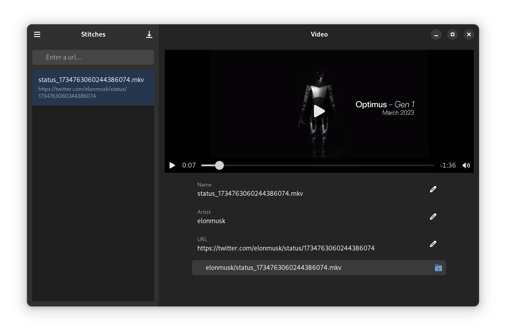

# stitches

This is a basic frontend for grabbing clips from youtube, rumble, or X (twitter). It 
is meant to be a way of grabbing multiple clips for use in meta-content creation.

Stitches aims to be a solution for coraling the massive amount of social media content
into something consumable by a content creator to produce additional content (meta-content)

## Goals
* Retain Context for Splices 
    * Videos should have links as a reference to the original content
    * Videos pulled from content providers will need to have embedded values to verify content

## Future Support
* md5 videos for downloaded videos
* embed exif information so videos can be validated externally
* Any other mechanisms to validate a video came from a specific author
 
## Known issues
* Concurrent downloads have issues due to the current (broken) threading implementation
* No configuration for saving the current state to a file
* No configuration for setting a default Video directory
